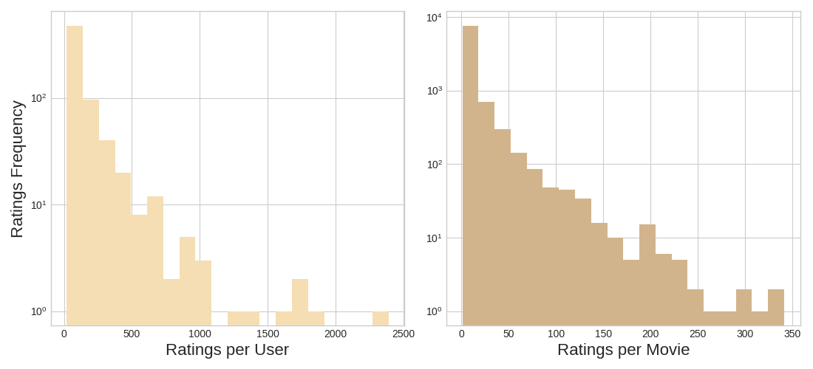
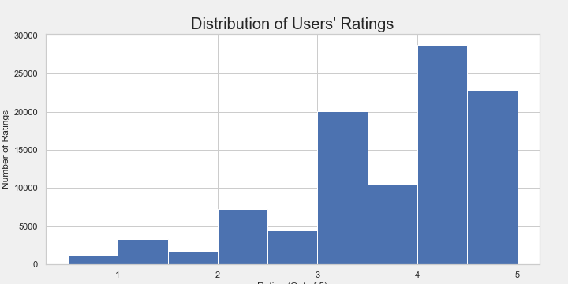
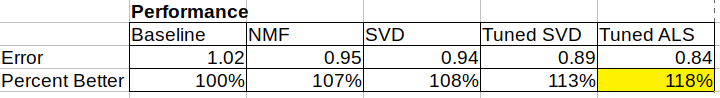
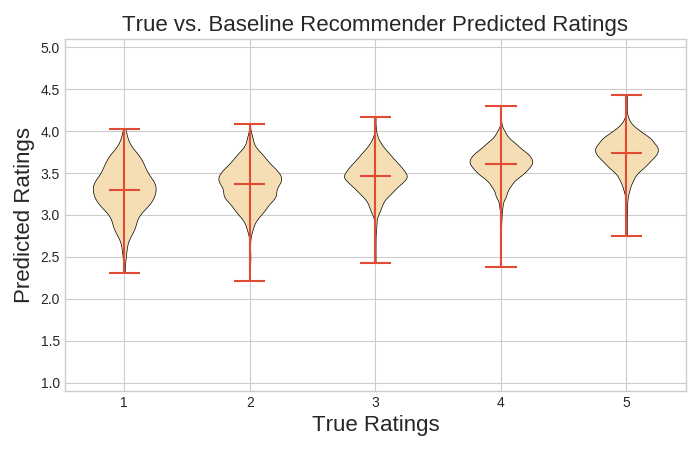
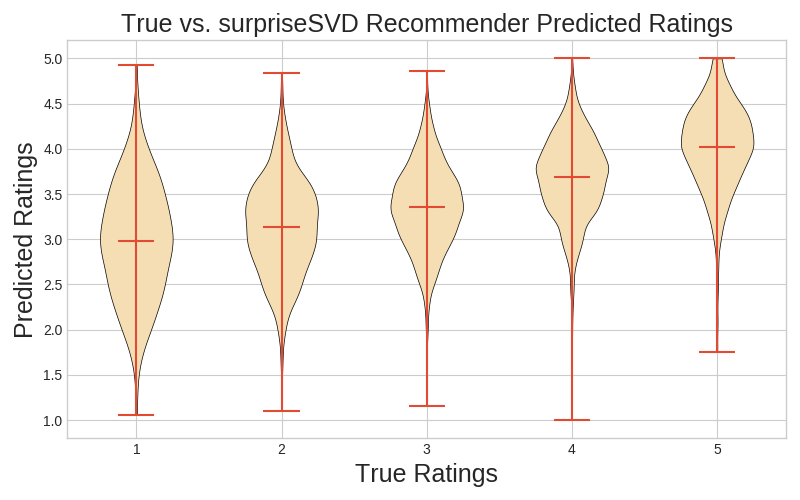
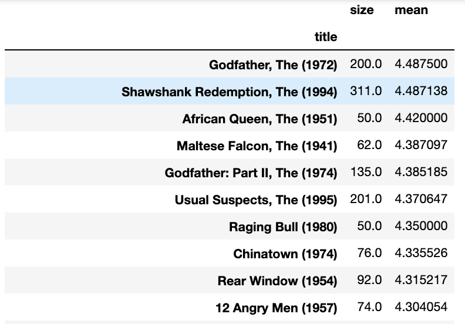
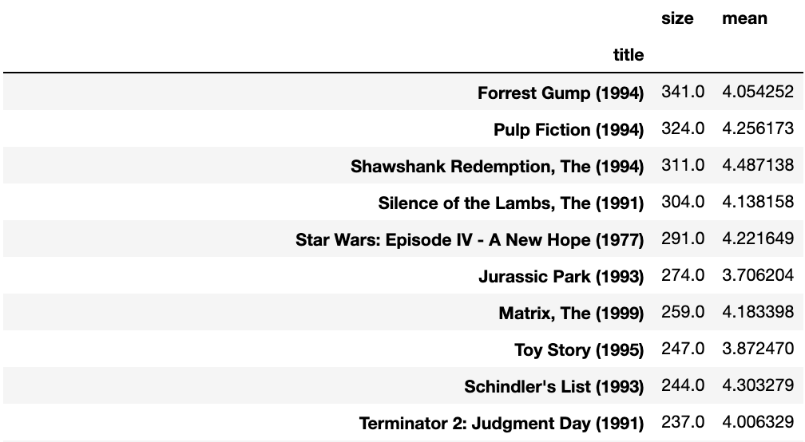

# Improving Movie Recommender For **Movies-Legit**

[GroupLens Move Dataset](https://grouplens.org/datasets/movielens/)

## explore new solutions! is todays motto

There are three aims we followed for todays EXCITING results

1. Make a new recommender
2. Compare to the baseline recommender
3. Show why it is better

## EDA Movie Ratings

Ratings are made on a 5-star scale, with half-star increments (0.5 stars - 5.0 stars).

## Baseline Recommender vs. Surprise SVD Recommender

Model error & percentage improvement table

Distribution of rating predictions

## Looking At The Predictions

Movie Titles Baseline recommendations  

User 200 Recommendations  

|   movieId | title                                                      | genres               |
|----------:|:-----------------------------------------------------------|:---------------------|
|      3414 | Love Is a Many-Splendored Thing (1955)                     | Drama|Romance|War    |
|     73290 | Hachiko: A Dog's Story (a.k.a. Hachi: A Dog's Tale) (2009) | Drama                |
|      8530 | Dear Frankie (2004)                                        | Drama|Romance        |
|     90061 | Myth of the American Sleepover, The (2010)                 | Comedy|Drama|Romance |
|      4755 | Wish Upon a Star (1996)                                    | Comedy               |
|      8535 | De-Lovely (2004)                                           | Drama|Musical        |
|     59684 | Lake of Fire (2006)                                        | Documentary          |
|     65037 | Ben X (2007)                                               | Drama                |
|     76173 | Micmacs (Micmacs à tire-larigot) (2009)                    | Comedy|Crime         |
|       766 | I Shot Andy Warhol (1996)                                  | Drama                |

User 200 NMF/ALS Recs:  
['Art of War, The (2000)', 'King Is Alive, The (2000)', 'Maelström (2000)', 'Journey, The (El viaje) (1992)', 'Ice Princess (2005)', 'Family Stone, The (2005)', 'Flicka (2006)', 'Secretariat (2010)', 'Innocence (2000)', 'I Know That Voice (2013)']

## Conclusion

Our new recommender is THE BEST. Let's use it!

