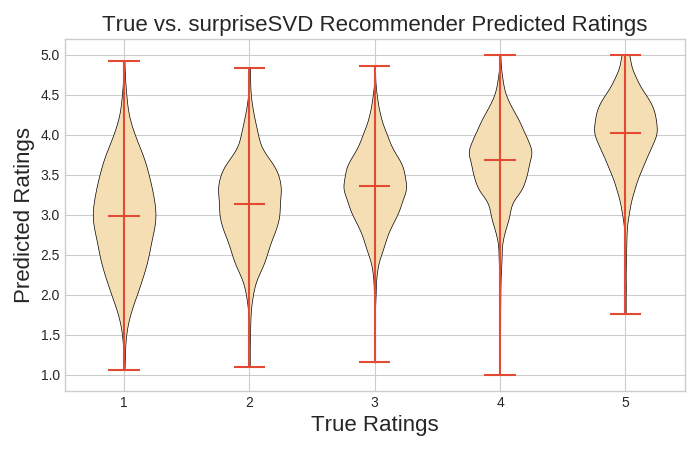

# Improving Movie Recommender For **Movies-Legit**

[GroupLens Move Dataset](https://grouplens.org/datasets/movielens/)

## explore new solutions! is todays motto

There are three aims we followed for todays EXCITING results

1. Make a new recommender
2. Compare to the baseline recommender
3. Show why it is better

## EDA Movie Ratings

Ratings are made on a 5-star scale, with half-star increments (0.5 stars - 5.0 stars).

## Baseline Recommender vs. Surprise SVD Recommender

Model error & percentage improvement table

Distribution of rating predictions

## Looking At The Predictions

movie titles SVD recommendations

## Conclusion

Our new recommender is THE BEST. Let's use it!

    
Helpful hints
------------------

  * A challenge with the Spark solution can be to implement a *mean of means* baseline
  * Make sure you show an example of a prediction
  * **The numeric results are not as important here as how well you communicate what you have done**  
  * Finally, the 'bosses' are not real keen thinking too hard about
    RMSE or MAE.  You might be able to explain it to them, but if you
    report it as percent improvement over mean-of means they are more
    likely to listen.
    
We would also like you to include some discussion about how you would
move from prototype to production.
